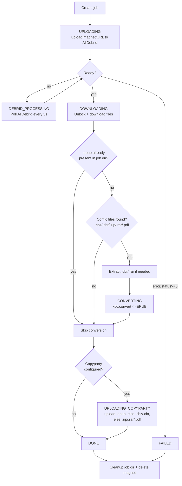

<p align="center">
  
</p>

# Inkpipe

Manga/comic pipeline: search, download, convert, and upload to your e-reader.

> **⚠️ Disclaimer:** This project is developed solely to reflect my personal usage and needs. It is not intended for general production use, and stability, backwards compatibility, and support are not guaranteed.

## Features

- **Search** Prowlarr for manga/comics
- **Download** via AllDebrid
- **Convert** CBZ/CBR/ZIP/RAR/PDF to EPUB using KCC (Kindle Comic Converter)
- **Upload** to Copyparty file server
- **Browse** your Komga library with covers and filters
- **Watch** for new releases and get notified via web push and/or Telegram

## Pipeline

Each job runs through the following stages (`packages/server/src/layers/pipeline/Pipeline.ts`):



Notes:
- If an `.epub` file already exists in the job directory, KCC conversion is skipped entirely.
- Copyparty upload prefers `.epub`, then falls back to `.cbz`/`.cbr`, then `.zip`/`.rar`/`.pdf`, and is skipped if Copyparty isn't configured.
- On failure at any stage, the job is marked `FAILED` and cleanup (temp files + AllDebrid magnet) always runs.

## Architecture

Monorepo: five packages managed by Bun workspaces.

| Package | Description | Stack |
|---------|-------------|-------|
| `packages/shared` | Domain types, API contracts, errors | Effect Schema v4 |
| `packages/db` | SQLite database layer (WAL mode) | Bun SQLite, Effect v4 |
| `packages/server` | HTTP API + pipeline orchestration | Bun.serve, Effect v4, @effect/platform-bun |
| `packages/watcher` | Background watch process | Effect v4, web-push, Telegram Bot API |
| `packages/web` | React SPA frontend | React 19, React Router v7, Ark UI v5, Tailwind v4, TanStack Query v5 |

## Local development

```bash
# Install dependencies
bun install

# Start both server and frontend
bun run dev

# Server: http://localhost:3000
# Web:   http://localhost:5173

# Run tests
bun run test

# Type check all packages
bun run typecheck
```

## Docker

```bash
docker compose up -d
```

Access at `http://localhost:3001` (port mapped from container 3000).

Data (database, settings, push keys) is persisted in the `inkpipe-data` Docker volume. To back up or use a host directory instead:

```yaml
# In docker-compose.yml, replace the named volume with a bind mount:
volumes:
  - ~/.inkpipe:/data
```

## Configuration

Settings are persisted to `~/.inkpipe/inkpipe.db` (Bun SQLite). Set `INKPIPE_DATA_DIR` to override this path (Docker uses `/data` by default). Required:

- **Prowlarr** — URL + API key for torrent search
- **AllDebrid** — API key for debrid service
- **KCC** — Docker image for comic conversion
- **Copyparty** (optional) — URL for file uploads
- **Komga** (optional) — URL + API key for library browsing
- **Telegram** (optional) — bot token + chat ID for watch notifications

### Telegram notifications

Watches notify over web push by default; add a Telegram bot to also get alerts on your phone.

1. Message [@BotFather](https://t.me/BotFather) on Telegram, run `/newbot`, and copy the bot token it gives you.
2. Message [@userinfobot](https://t.me/userinfobot) (or your new bot itself) to get your numeric chat ID.
3. In Inkpipe, go to **Settings → Telegram**, paste the bot token and chat ID, save, then click **Send Test Message** to confirm it works.

The watcher process sends a Telegram message (alongside the existing push notification) whenever a watch finds new matches.
